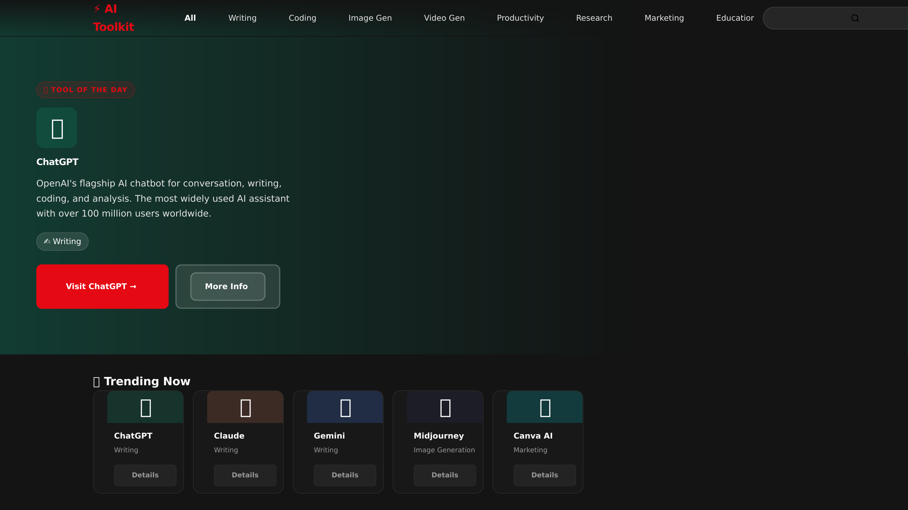

#  AI Toolkit

A Netflix-style AI tool discovery platform — browse, search, and compare 53 AI tools across 8 categories, built with server-rendered Python (no frontend framework, no database, no JavaScript beyond a 3-line navbar effect).



## Features

- 53 AI tools across 8 categories (Writing, Coding, Image Generation, Video Generation, Productivity, Research, Marketing, Education)
- Netflix-dark UI — `#141414` background, `#E50914` red accent
- Hero section with a branded gradient background computed server-side in Python
- Trending row with Netflix-style rank numbers
- 8 horizontal category rows with CSS scroll snap
- Server-side search via HTML GET form (`/search?q=...`)
- Category filter pages (`/category/Writing`)
- Full tool detail pages (`/tool/1`) — shareable URLs, no modals
- Mobile-responsive at 768px and 480px breakpoints
- Custom 404 error page

## Tech Stack

| Layer     | Technology                                                |
|-----------|------------------------------------------------------------|
| Backend   | Python 3 + Flask                                          |
| Templates | Jinja2                                                      |
| Styling   | Pure CSS (custom properties, flexbox, grid, scroll-snap)   |
| Not used  | React, Node.js, JS frameworks, databases                    |

## Run Locally

```bash
# 1. Install dependencies
pip install -r requirements.txt

# 2. Start the server
python app.py

# 3. Open in browser
# http://127.0.0.1:5000
```

## Folder Structure

```
AI-Toolkit/
├── app.py            # Flask routes, helper functions, Jinja2 filters
├── data.py            # 53 AI tools as a Python list of dicts
├── requirements.txt   # Flask
├── templates/
│   ├── base.html      # Navbar, footer, shared layout
│   ├── index.html     # Homepage: hero + trending + category rows
│   ├── search_results.html
│   ├── category.html
│   ├── tool_detail.html
│   └── 404.html
├── static/
│   └── style.css      # Netflix dark theme, CSS custom properties
└── screenshots/
    └── AI-Toolkit.png
```

## Author

Built by **Vishnu** — [vishnukayyala@gmail.com](mailto:vishnukayyala@gmail.com)
